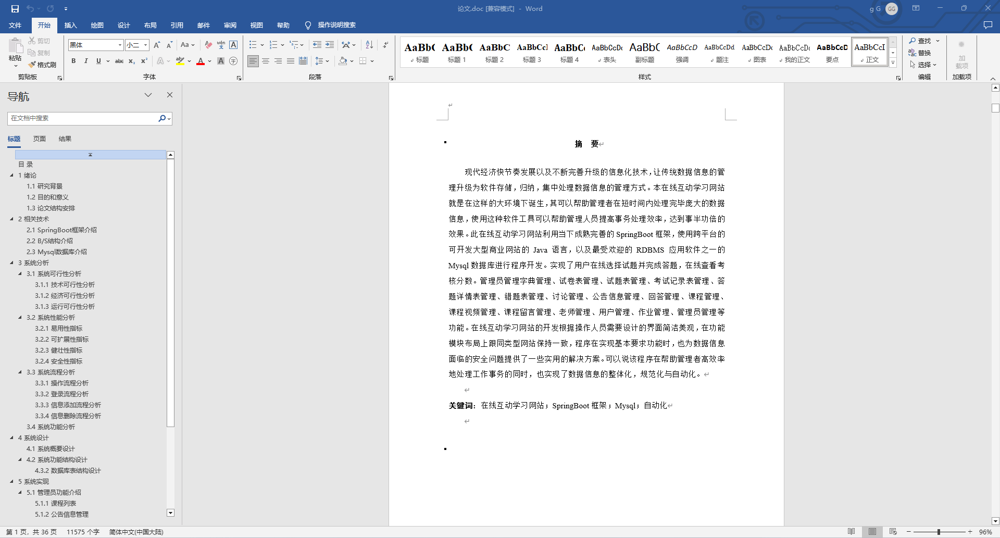
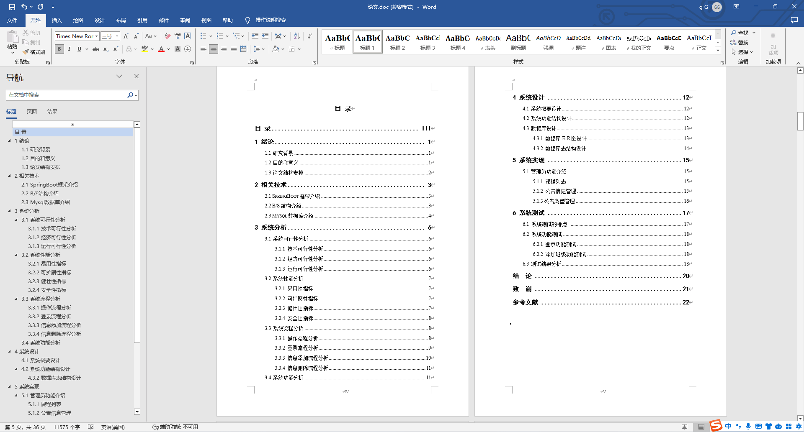
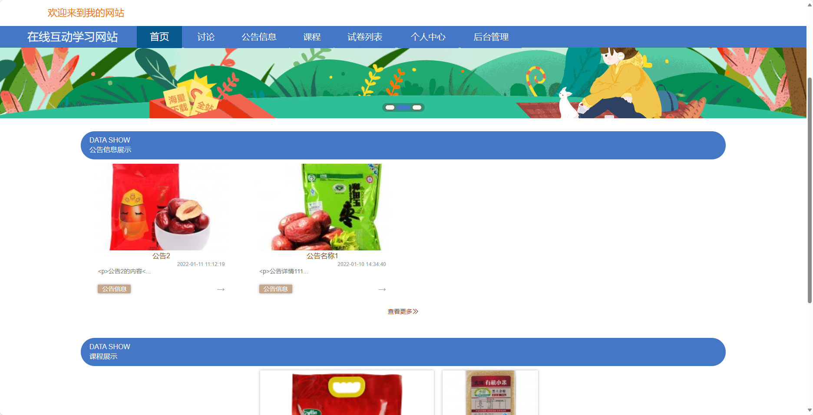
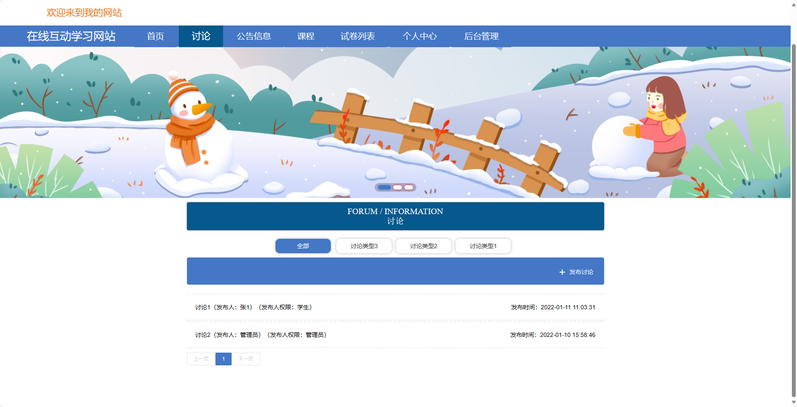
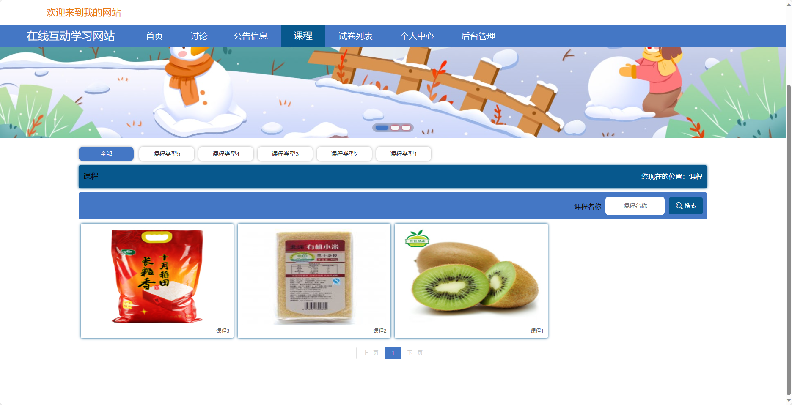
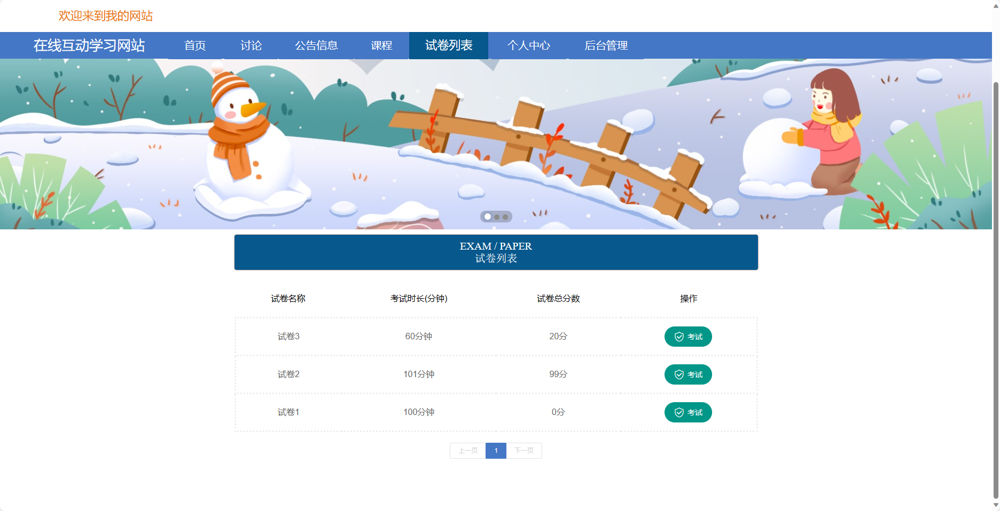
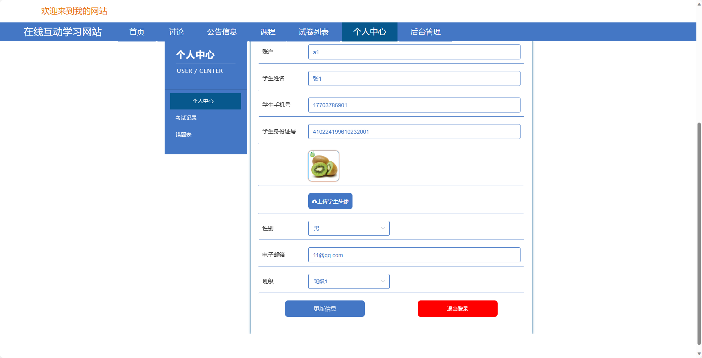
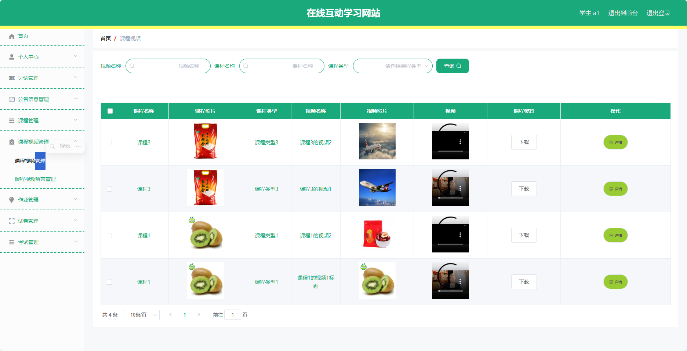
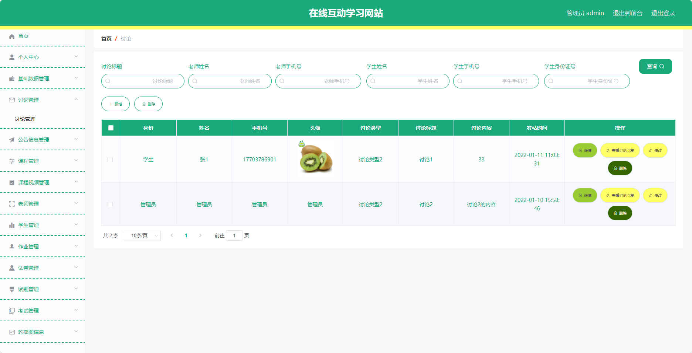

基于SpringBoot的在线互动学习网站（程序+论文）
=
- 完整代码获取地址：从戎源码网 ([https://armycodes.com/](https://armycodes.com/))
- 作者微信：19941326836  QQ：952045282 
- 承接计算机毕业设计、Java毕业设计、Python毕业设计、深度学习、机器学习
- 选题+开题报告+任务书+程序定制+安装调试+论文+答辩ppt 一条龙服务
- 所有选题地址https://github.com/nature924/allProject

一、项目介绍
---
基于Spring Boot框架实现的在线互动学习网站，系统包含三种角色：管理员、老师、学生,系统分为前台和后台两大模块，主要功能如下。
### - 前台：
  - 首页：展示网站的概况和热门内容。
  - 讨论：用户可以参与课程讨论，交流学习经验。
  - 公告信息：发布学校或网站的公告信息。
  - 课程：展示各类课程的信息和内容。
  - 试卷列表：列出所有可用的试卷供用户选择。
  - 个人中心：用户可以管理个人信息和学习记录。

### - 后台：
  - 用户：
    - 个人中心：管理个人信息。
    - 讨论管理：管理用户的讨论内容。
    - 公告信息管理：发布和管理公告信息。
    - 课程管理：管理课程的相关信息。
    - 课程视频管理：管理课程视频资料。
    - 作业管理：管理用户提交的作业信息。
    - 试卷管理：管理试卷的相关信息。
    - 考试管理：管理考试安排和成绩。
  
###- 管理员：
    - 个人中心：管理个人信息。
    - 基础数据管理：管理系统的基础数据，如用户信息、课程信息等。
    - 讨论管理：管理用户的讨论内容。
    - 公告信息管理：发布和管理公告信息。
    - 课程管理：管理课程的相关信息。
    - 课程视频管理：管理课程视频资料。
    - 老师管理：管理老师的信息和权限。
    - 学生管理：管理学生的信息和权限。
    - 作业管理：管理用户提交的作业信息。
    - 试卷管理：管理试卷的相关信息。
    - 试题管理：管理试题库的内容。
    - 考试管理：管理考试安排和成绩。
    - 轮播图信息：管理网站首页轮播图的展示内容。

###- 老师：
    - 个人中心：管理个人信息。
    - 讨论管理：管理课程讨论内容。
    - 公告信息管理：发布和管理公告信息。
    - 课程管理：管理所负责的课程信息。
    - 课程视频管理：管理课程视频资料。
    - 学生管理：管理学生的学习情况。
    - 作业管理：管理学生提交的作业信息。
    - 试卷管理：管理试卷的相关信息。
    - 考试管理：管理课程相关的考试安排和成绩。

二、项目技术
---
- 编程语言：Java
- 数据库：MySQL
- 项目管理工具：Maven
- 前端技术：VUE、HTML、Jquery、Bootstrap
- 后端技术：Spring、SpringMVC、MyBatis

三、运行环境
---
- 操作系统：Windows、macOS都可以
- JDK版本：JDK1.8以上都可以
- 开发工具：IDEA、Ecplise、Myecplise都可以
- 数据库: MySQL5.7以上都可以
- Tomcat：任意版本都可以
- Maven：任意版本都可以

四、运行截图
---
### 论文截图：

### 程序截图：

